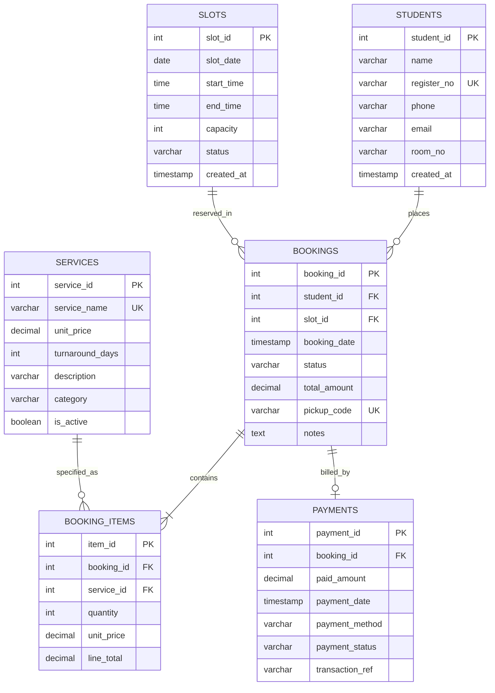

# Entity-Relationship (ER) Diagram & Relational Schema

## Campus Laundry Slot Booking and Billing System

### 1. Conceptual ER Diagram (Mermaid)

---

### 2. Relational Schema Notation

* **`STUDENTS`** (`student_id` [PK], `name`, `register_no` [UNIQUE], `phone`, `email`, `room_no`, `created_at`)
* **`SERVICES`** (`service_id` [PK], `service_name` [UNIQUE], `unit_price`, `turnaround_days`, `description`, `category`, `is_active`)
* **`SLOTS`** (`slot_id` [PK], `slot_date`, `start_time`, `end_time`, `capacity`, `status`, `created_at`, `UNIQUE(slot_date, start_time, end_time)`)
* **`BOOKINGS`** (`booking_id` [PK], `student_id` [FK -> STUDENTS.student_id], `slot_id` [FK -> SLOTS.slot_id], `booking_date`, `status`, `total_amount`, `pickup_code` [UNIQUE], `notes`)
* **`BOOKING_ITEMS`** (`item_id` [PK], `booking_id` [FK -> BOOKINGS.booking_id], `service_id` [FK -> SERVICES.service_id], `quantity`, `unit_price`, `line_total`)
* **`PAYMENTS`** (`payment_id` [PK], `booking_id` [FK -> BOOKINGS.booking_id], `paid_amount`, `payment_date`, `payment_method`, `payment_status`, `transaction_ref`)

---

### 3. Cardinality & Business Rules

1. **Student to Bookings (1 : M)**:
   - One student can make zero, one, or multiple laundry bookings over the semester.
   - Each booking belongs to exactly one student.
2. **Slot to Bookings (1 : M)**:
   - A time slot can have multiple student bookings up to its predefined `capacity` constraint.
   - Each booking is assigned to one specific slot.
3. **Booking to Booking Items (1 : M)**:
   - Each booking has at least one laundry service item (e.g. 3 shirts Wash & Fold, 1 blazer Dry Clean).
   - Each line item belongs to one booking.
4. **Service to Booking Items (1 : M)**:
   - A standard laundry service can appear across many bookings.
5. **Booking to Payments (1 : 1 or 1 : 0..1)**:
   - A booking is associated with a payment record verifying cash, UPI, or student card settlement.
